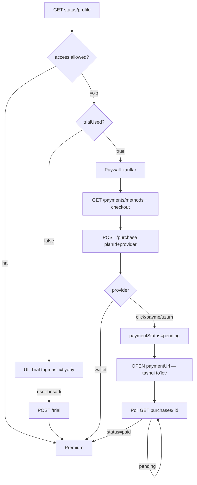

# Cal AI / Nutrition — Mobile Frontend

**Base:** `https://core.pointcoffee.uz/` (yoki staging)  
**Auth:** `Authorization: Bearer <user_JWT>` — alohida login/register **yo‘q** (Point Coffee JWT).  
**Nutrition javob:** Raw JSON (`{status,result}` wrapper **yo‘q**). Xato: `{ success:false, statusCode, message }`.  
**Core umumiy** (`/users/me`, `/payments/methods`, `/wallet`): ko‘pincha `{ status, result }` — client `result` ni ochadi.

---

## 0. Muhim qoidalar

1. **To‘lovsiz obuna ochilmaydi.** `POST /nutrition/subscriptions/purchase` faqat `pending` yozadi. Aktiv faqat:
   - Click/Payme/Uzum **webhook** (`paid`) dan keyin, yoki
   - `provider: "wallet"` (balansdan darhol).
2. **`pending` ≠ aktiv.** Purchase `pending` bo‘lsa — premium **yo‘q**.
3. **Trial avtomatik chaqirilmasin.** `POST /nutrition/subscriptions/trial` faqat foydalanuvchi «1 oy bepul» tugmasini bosganda. Onboarding / app open / WebView boot da **chaqirmang**.
4. **`paymentUrl`** — faqat `https://my.click.uz/...`, `https://checkout.paycom.uz/...`, `https://uzumbank.uz/...` kabi provider URL. `pointcoffee://` ni to‘lovga ochmang (return deep link).
5. Checkout UI da to‘lov usullari: **`GET /payments/methods`** (hardcode emas). Wallet UI nomi: **«Кошелёк»** (API `CoffeeBank` bo‘lsa ham). Balans `0` bo‘lsa default tanlov — keyingi provider (click/payme/uzum).

---

## 1. Obuna holatini qanday bilish

| API | Qachon |
|---|---|
| `GET /profile` | App / WebView ochilganda / paywall |
| `GET /nutrition/subscriptions/status` | Batafsil (`trialUsed`, `access`) |
| `GET /nutrition/subscriptions/purchases/:purchaseId` | To‘lovdan keyin **polling** |

### GET `/nutrition/subscriptions/status`

```json
{
  "subscription": null,
  "active": null,
  "access": { "allowed": false, "code": "SUBSCRIPTION_REQUIRED", "daysLeft": 0 },
  "trialUsed": false
}
```

Aktiv:

```json
{
  "subscription": {
    "planId": "month",
    "label": "1 месяц",
    "paidAt": "2026-07-21T11:00:00.000Z",
    "expiresAt": "2026-08-20T11:00:00.000Z"
  },
  "active": { "planId": "month", "label": "1 месяц", "paidAt": "...", "expiresAt": "...", "daysLeft": 30 },
  "access": { "allowed": true, "code": "OK", "daysLeft": 30 },
  "trialUsed": true
}
```

### GET `/profile` (qisqa)

| Maydon | Gate |
|---|---|
| `subscriptionActive` | **true** → premium |
| `subscriptionStatus` | `none` \| `active` \| `expired` |
| `daysLeft` | qolgan kun |
| `subscription.planId` | `free_trial` / `month` / … |

> UI da «Активна» + «1 месяц бесплатно» → **trial** (`planId=free_trial`), pullik `month` emas.

---

## 2. Oqim



---

## 3. Endpointlar

### Nutrition — har doim (obunasiz)

| Method | Path |
|---|---|
| GET | `/profile` |
| PUT | `/profile` |
| DELETE | `/profile` |
| GET | `/nutrition/plans` |
| GET | `/nutrition/subscriptions/status` |
| POST | `/nutrition/subscriptions/trial` |
| POST | `/nutrition/subscriptions/purchase` |
| GET | `/nutrition/subscriptions/purchases/:purchaseId` |

### Nutrition — premium (`403` agar obuna yo‘q/tugagan)

| Method | Path |
|---|---|
| GET/POST/PATCH/DELETE | `/meals`… |
| POST | `/upload/meal-photo` |
| POST | `/analyze` |

### Core (checkout / profil UI — JWT bilan)

| Method | Path | Vazifa |
|---|---|---|
| GET | `/users/me` | Ism, telefon, avatar |
| GET | `/payments/methods` | To‘lov usullari (`id`, `code`, `name`, `type`, `iconUrl`, `isActive`, `sortOrder`) |
| GET | `/wallet` | Koshelok balansi |

`provider` map (`code` → purchase):

| `code` / `type` | `provider` |
|---|---|
| `wallet` | `wallet` |
| `click` | `click` |
| `payme` | `payme` |
| `uzum` / `uzumbank` | `uzum` |

### Return URL (browser, JWT yo‘q)

| Method | Path | Vazifa |
|---|---|---|
| GET | `/nutrition/subscriptions/purchases/callback?ref=77xxxxxx` | → `pointcoffee://nutrition-purchase?purchaseId=…&paymentStatus=success\|failed` |

---

## 4. Trial (1 marta, bepul)

```http
POST /nutrition/subscriptions/trial
```

- Faqat user tugmasi
- Muvaffaqiyat: profil + `subscription.planId = "free_trial"`, `subscriptionActive: true`
- `409 TRIAL_ALREADY_USED` / `409 SUBSCRIPTION_ALREADY_ACTIVE`

---

## 5. Pullik obuna

### GET `/nutrition/plans`

```json
[
  { "planId": "free_trial", "label": "1 месяц бесплатно", "price": 0, "durationDays": 30, "isTrial": true },
  { "planId": "month", "label": "1 месяц", "price": 15000, "durationDays": 30, "isTrial": false }
]
```

`isTrial: true` ni **purchase** ga yubormang → `400 USE_TRIAL_ENDPOINT`.

### GET `/payments/methods` (checkout UI)

Faol usullarni ko‘rsating. Wallet qatori: doim **«Кошелёк»** + `GET /wallet` balansi. Tashqi usullar (click/payme/uzum) — yonma-yon chip; logo local asset yoki `iconUrl`.

### POST `/nutrition/subscriptions/purchase`

```json
{ "planId": "month", "provider": "click" }
```

`provider`: `click` | `payme` | `uzum` | `wallet`

#### Click / Payme / Uzum — javob

```json
{
  "purchaseId": "uuid",
  "paymentRef": "77161216",
  "paymentStatus": "pending",
  "paymentUrl": "https://my.click.uz/services/pay/?service_id=...&amount=15000&transaction_param=77161216&return_url=...",
  "provider": "click"
}
```

**Frontend:**

1. `paymentUrl` ni **tashqi** oching (SFSafariViewController / Chrome Custom Tabs / `Linking.openURL` / `window.location`). Ilova ichidagi fake paywall emas.
2. Obunani **darhol** aktiv deb belgilamang.
3. Poll:

```http
GET /nutrition/subscriptions/purchases/{purchaseId}
```

```json
{
  "purchaseId": "uuid",
  "planId": "month",
  "amount": 15000,
  "status": "pending",
  "paymentStatus": "pending",
  "provider": "click",
  "paymentRef": "77161216",
  "paidAt": null,
  "subscriptionActive": false,
  "subscription": null
}
```

`status === "paid"` **yoki** `subscriptionActive === true` bo‘lguncha 2–3 s qayta so‘rang (max ~2 min). Keyin `GET /nutrition/subscriptions/status`.

4. Deep link:

`pointcoffee://nutrition-purchase?purchaseId=<uuid>&paymentStatus=success|failed`

Deep link kelganda yana purchase GET — `success` ham webhook kechiksa `pending` bo‘lishi mumkin.

#### Wallet

```json
{ "purchaseId": "uuid", "subscription": { "planId": "month", "...": "..." }, "provider": "wallet" }
```

Darhol aktiv. `409 INSUFFICIENT_FUNDS`.

---

## 6. Xatolar

| HTTP | message | Harakat |
|---|---|---|
| 403 | `SUBSCRIPTION_REQUIRED` | Paywall / trial tugmasi |
| 403 | `SUBSCRIPTION_EXPIRED` | Faqat purchase |
| 409 | `TRIAL_ALREADY_USED` | Purchase |
| 409 | `SUBSCRIPTION_ALREADY_ACTIVE` | Premium ochiq |
| 409 | `INSUFFICIENT_FUNDS` | Wallet topup |
| 400 | `USE_TRIAL_ENDPOINT` | Trial endpoint |
| 400 | `PAYMENT_URL_UNAVAILABLE` | Qayta urinish / boshqa provider |
| 400 | `PLAN_NOT_PURCHASABLE` / `PLAN_NOT_AVAILABLE` | Boshqa tarif |

---

## 7. Meals / upload / analyze

Premium guard. Qisqa:

- `GET /meals?limit=50`
- `POST /meals`, `PATCH /meals/:id`, `DELETE /meals/:id`, `DELETE /meals`
- `POST /upload/meal-photo` → `{ url }`
- `POST /analyze` — faqat `{ image }` **yoki** `{ text }`

---

## 8. WebView (coffee-mobile-app → ai-tracker-coffee)

Cal AI sayt mobil ilova ichida WebView da ochiladi. Alohida auth sahifasi **yo‘q**.

### JWT bridge

| Yo‘nalish | Format |
|---|---|
| Native → Web | `window.__COFFEE_JWT__` + `postMessage({ type: "AUTH_TOKEN", token })` |
| Web → Native | `ReactNativeWebView.postMessage(JSON.stringify({ type: "TOKEN_EXPIRED" }))` |

Har nutrition/core so‘rovda: `Authorization: Bearer <token>`.

### Kamera (LAN / HTTP da `getUserMedia` ishlamasligi mumkin)

| Yo‘nalish | Format |
|---|---|
| Web → Native | `{ type: "REQUEST_CAMERA" }` yoki `{ type: "REQUEST_GALLERY" }` |
| Native → Web | `{ type: "NATIVE_PHOTO", image: "data:image/jpeg;base64,..." }` |

WebView header: yopish **`×` o‘ngda** (`navigation.goBack()`).

### Config

- Mobile: `CAL_AI_URL` (`app.json` / `ENV`) — masalan local `http://192.168.x.x:3000`, prod keyin domen.
- Web: `NEXT_PUBLIC_API_URL=https://core.pointcoffee.uz`

---

## 9. Mobil / Web checklist

- [ ] App / WebView open da **trial chaqirilmaydi**
- [ ] Gate: `subscriptionActive` / `access.allowed` (`pending` purchase emas)
- [ ] Checkout: `GET /payments/methods` + `GET /wallet`; UI «Кошелёк»
- [ ] Balans `0` → default keyingi provider
- [ ] `paymentUrl` faqat https provider URL
- [ ] Purchase dan keyin poll `GET .../purchases/:id`
- [ ] Deep link `nutrition-purchase` → qayta poll
- [ ] `free_trial` faqat trial endpoint
- [ ] JWT inject + kamera native bridge
- [ ] WebView close `×` o‘ngda

---

**Admin tariflar:** [`NUTRITION_ADMIN.md`](NUTRITION_ADMIN.md)
